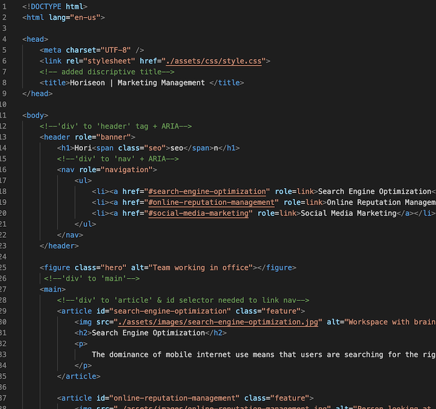
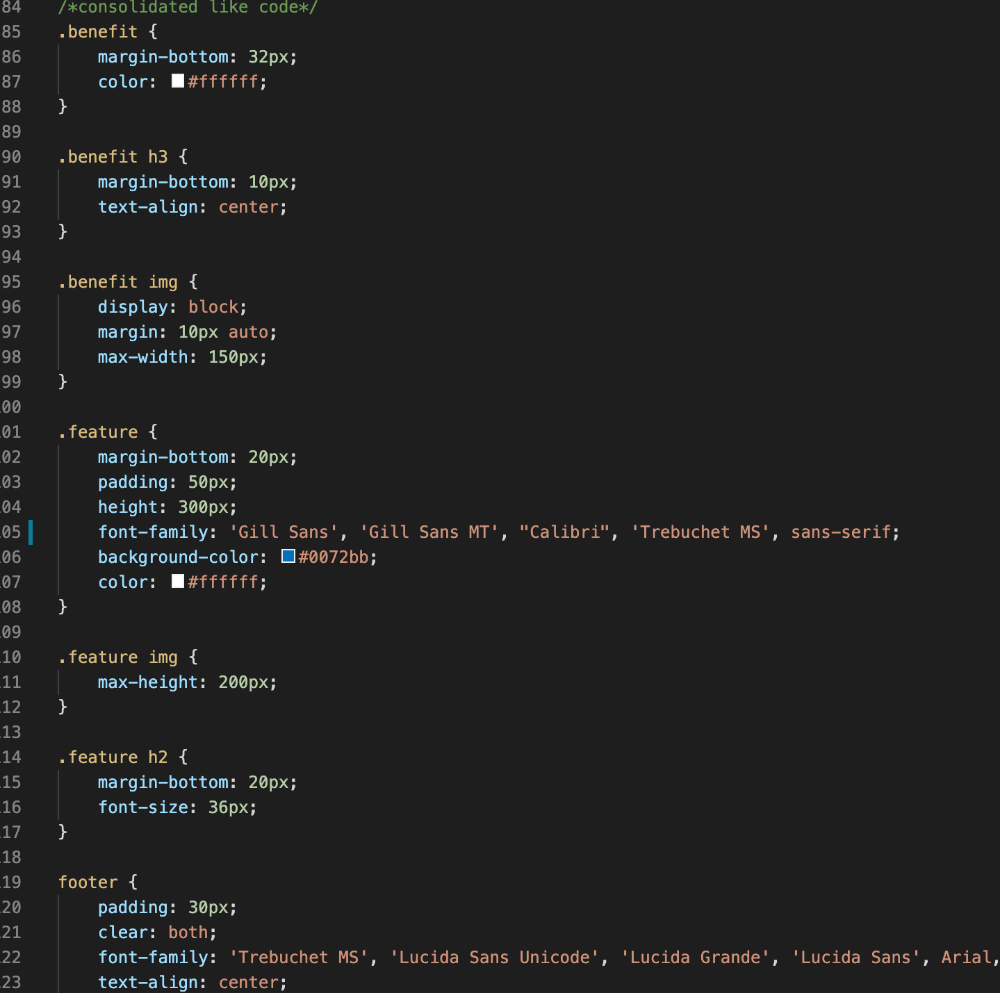

# Code Refractor for Horiseon
## The Client:
 Asked for a codebase that follows accessibilty standards so the site is optimized best for search engines.
## In HTML:
* Created more meaning by avoiding div tags and using more semantic elements like `<header>`, `<main>`, `<aside>`, `<footer>` and `<nav>` tags instead.
* Added `<alt>` and aria text to images for accesibility 

## In CSS:
* 
* 

### Screenshots of Refractored Code in HTML & CSS

### Link to Repo:  